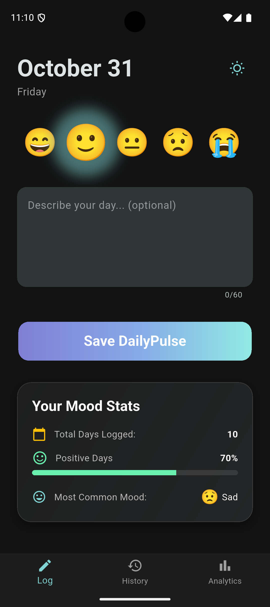
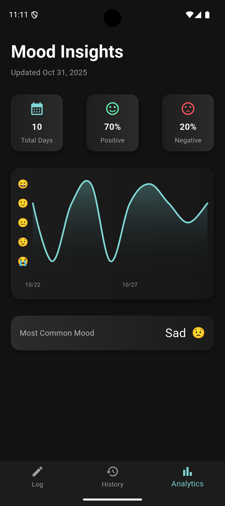

# 🧠 DailyPulse — Track Your Daily Emotions

**DailyPulse** is a minimalist mood tracker designed to help users reflect on their emotional well-being every day.  
Log your daily mood, view analytics, and observe trends that help improve mindfulness and self-awareness.

---

## 🌟 Features

- 📝 **Daily Mood Logging** — Quickly log emotions using intuitive emoji-based moods  
- 📊 **Mood Analytics** — View your emotional trends through interactive charts  
- 🌗 **Light & Dark Themes** — Toggle between calming dark and clean light themes  
- 💾 **Offline First** — Stores data locally using SQLite  
- ☁️ **Cloud Backup (Optional)** — Sync mood data to Firebase Firestore  
- 🔄 **Animated UI** — Smooth transitions with pulse effects and gradient buttons  
- 🧭 **Three-Tab Navigation** — Log, History, and Analytics for easy access  

---

## 📸 Screenshots

| Log Screen | History | Analytics |
|:------------:|:------------:|:------------:|
|  |  |  |

---

## 🎭 Emotion Logic

| Emoji | Label | Score | Description |
|:------:|:-------|:------:|:-------------|
| 😄 | Joyful | 5 | Represents a happy, fulfilling day |
| 🙂 | Good | 4 | Reflects calm positivity |
| 😐 | Stressed | 3 | Neutral or mildly tense mood |
| 😟 | Sad | 2 | Emotionally low or tiring day |
| 😭 | Very Sad | 1 | Deeply negative emotional state |

These scores drive the **analytics view**, calculating:  
- Overall mood trends  
- Positive vs. negative ratio  
- Most common emotion  

---

## 🧩 Tech Stack

| Category | Technology |
|-----------|-------------|
| **Frontend** | Flutter (Dart) |
| **State Management** | Provider |
| **Local Storage** | Sqflite |
| **Cloud Storage (Optional)** | Firebase Firestore |
| **Theme Management** | Shared Preferences |
| **UI/UX Tools** | Flutter ScreenUtil, Animations, fl_chart |

---

## ⚙️ Setup Instructions

### **Prerequisites**
- Flutter SDK ≥ **3.0.0**
- Dart SDK ≥ **3.0.0**
- Android Studio / VS Code (with Flutter/Dart extensions)
- (Optional) Firebase project setup

### **Installation**
```bash
# Clone the repository
git clone https://github.com/Uday-kiran9147/DailyPulse.git
cd DailyPulse

# Install dependencies
flutter pub get

# Run the app
flutter run
